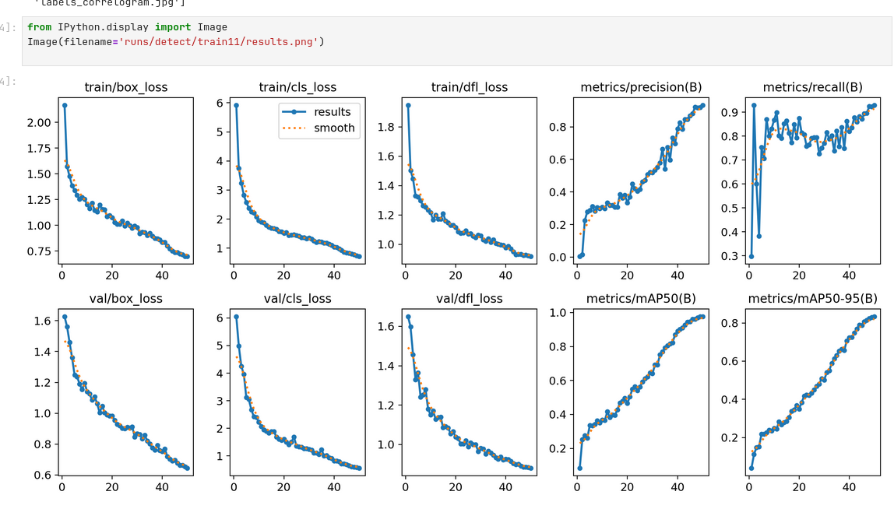
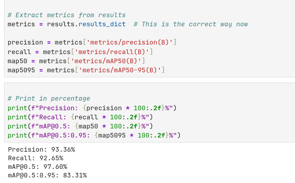

# 🧠 Ultrasound Analyzer with YOLOv8 and Streamlit

An AI-powered fetal ultrasound analysis tool that uses YOLOv8 for structure detection and diagnostic reporting. This web app is designed to assist healthcare professionals in assessing fetal development and risks (e.g., Down Syndrome) based on key anatomical markers in sagittal ultrasound images.


---

## ✨ Features

- 📷 Upload fetal ultrasound images (sagittal view)
- 🧠 YOLOv8-based detection of 9 key structures:
  - Thalami
  - Midbrain
  - Palate
  - 4th Ventricle
  - Cisterna Magna
  - Nuchal Translucency (NT)
  - Nasal Tip
  - Nasal Skin
  - Nasal Bone
- 📊 Generates a diagnostic report with:
  - NT Measurement
  - Presence of Nasal Bone
  - Cisterna Magna visibility
  - Risk assessment for Down Syndrome
- 🖼️ Visual output with bounding boxes
- 📄 Downloadable PDF report
- 🧪 Supports additional dataset testing

---

## Model INFO
- Model: YOLOv8n (custom trained)
- Training Data: 1528 annotated 2D sagittal ultrasound images
- Evaluation: External test set of 156 images
- Task: Object detection + diagnostic insight generation

## Technologies
 - Python
 - Streamlit
 - YOLOv8 (ultralytics)
 - OpenCV
 - FPDF (for PDF report generation)
 - Pandas & NumPy

## 📊 Model Performance




## 🖼️ Sample Output


 
## 🚀 Getting Started

### 🔧 Requirements

Install dependencies:

```bash
pip install -r requirements.txt
sudo xbps-install -Sy tesseract-ocr
streamlit run app.py

ultrasound-analysis/
│
├── app.py                      # Streamlit app
├── yolov8_model/               # YOLOv8 weights and training results
├── scripts/                    # Utility scripts for data conversion
├── assets/                     # Icons, styles, or demo images
├── runs/detect/               # Inference results from YOLO
├── ultrasound_report.pdf       # Example generated report
├── requirements.txt
└── README.md
